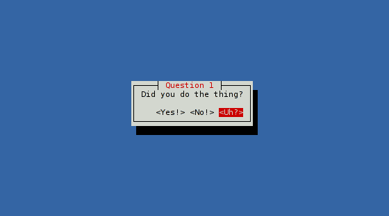

# Starting with cursive (2/3)

## Target goal

This time, we'll work on a slightly bigger example, where the user will need to
actually make some choices. Here is what the code will look like:

```rust,no_run
extern crate cursive;

use cursive::Cursive;
use cursive::views::Dialog;

fn main() {
    let mut siv = Cursive::new();

    siv.add_layer(Dialog::text("This is a survey!\nPress <Next> when you're ready.")
        .title("Important survey")
        .button("Next", show_next));

    siv.run();
}

fn show_next(s: &mut Cursive) {
    s.pop_layer();
    s.add_layer(Dialog::text("Did you do the thing?")
        .title("Question 1")
        .button("Yes!", |s| show_answer(s, "I knew it! Well done!"))
        .button("No!", |s| show_answer(s, "I knew you couldn't be trusted!"))
        .button("Uh?", |s| s.add_layer(Dialog::info("Try again!"))));
}

fn show_answer(s: &mut Cursive, msg: &str) {
    s.pop_layer();
    s.add_layer(Dialog::text(msg)
        .title("Results")
        .button("Finish", |s| s.quit()));
}
```



## Preparation

This time you're not a beginner anymore, so we'll skip the introduction!
Let's start from a basic cursive application:

```rust,no_run
extern crate cursive;

use cursive::Cursive;

fn main() {
    let mut siv = Cursive::new();

    siv.run();
}
```

## Dialogs

Instead of directly using a [`TextView`], we'll use a [`Dialog`] this time.
A dialog is wrapper with a frame around another view, and optionally a title
and/or buttons.

[`Dialog::new`] directly takes a view, so we'll directly give it the
`TextView`:

```rust,no_run
extern crate cursive;

use cursive::Cursive;
use cursive::views::Dialog;
use cursive::views::TextView;

fn main() {
    let mut siv = Cursive::new();

    siv.add_layer(Dialog::new(TextView::new("...")));

    siv.run();
}
```

Since creating a `Dialog` around a `TextView` is a pretty common task,
[Dialog::text`] is a shortcut function that directly does that. Our line
becomes a little shorter (and we don't need to import
`cursive::views::TextView` anymore):

```rust,ignore
siv.add_layer(Dialog::text("..."));
```

Next, let's add a title. To do that, `Dialog` has a chainable [`Dialog::title`]
method. It takes the dialog by value, and return it back, making function
chains easy:

```rust,ignore
siv.add_layer(Dialog::text("...").title("..."));
```

This way of chaining method to set-up the view is very common in cursive. Most
views provide chainable variants of their methods, to allow creating the view
and configuring it in one spot.

[`Dialog::title`]: http://gyscos.github.io/Cursive/cursive/views/struct.Dialog.html#method.title

## Buttons

Our dialog looks better than a `TextView` alone, but it's still missing some
action. Adding some buttons there will help.

Just like with the title, `Dialog` has a [`Dialog::button`] method to add a
button in a chain. This method takes a label and a callback, the same kind
we saw in the previous tutorial:

```rust,ignore
siv.add_layer(Dialog::text("...")
    .title("...")
    .button("Quit", |s| s.quit()));
```

Only this time, we don't want to exit the application right away. Instead of
packing everything into the closure, let's use a separate function for the
callback. Here is the current state:

```rust,no_run
extern crate cursive;

use cursive::Cursive;
use cursive::views::Dialog;

fn main() {
    let mut siv = Cursive::new();

    siv.add_layer(Dialog::text("This is a survey!\nPress <Next> when you're ready.")
        .title("Important survey")
        .button("Next", show_next));

    siv.run();
}

fn show_next(s: &mut Cursive) {
    // Empty for now
}
```

## Layers

After the user presses the `<Next>` button, we want to hide the current popup
and show a new one instead. We'll use [`Cursive::pop_layer`] to do that.

Then, we add a new `Dialog`, this time with a few more buttons:

```rust,ignore
fn show_next(s: &mut Cursive) {
    s.pop_layer();
    s.add_layer(Dialog::text("Did you do the thing?")
        .title("Question 1")
        .button("Yes!", |s| ()) //< Do something interesting here...
        .button("No!", |s| ())  //< And here as well...
        .button("Uh?", |s| ()); //< And finally here too.
}
```

As you see, `Dialog::button()` can be called several times to add more buttons.

The `<Uh?>` button will add a new popup, without removing the current one:
it'll act as a dismissable infobox. `Dialog::info()` is a shortcut to build
such a popup:

```rust,ignore
fn show_next(s: &mut Cursive) {
    s.pop_layer();
    s.add_layer(Dialog::text("Did you do the thing?")
        .title("Question 1")
        .button("Yes!", |s| ()) //< We'll fill this callback soon,
        .button("No!", |s| ())  //< along with this one.
        .button("Uh?", |s| s.add_layer(Dialog::info("Try again!"))));
}
```

Finally, let's have the "Yes" and "No" buttons use the same callback method to
print a message, but with a different text parameter:

```rust,ignore
fn show_next(s: &mut Cursive) {
    s.pop_layer();
    s.add_layer(Dialog::text("Did you do the thing?")
        .title("Question 1")
        .button("Yes!", |s| show_answer(s, "I knew it! Well done!"))
        .button("No!", |s| show_answer(s, "I knew you couldn't be trusted!"))
        .button("Uh?", |s| s.add_layer(Dialog::info("Try again!"))));
}

fn show_answer(s: &mut Cursive, msg: &str) {
    s.pop_layer();
    s.add_layer(Dialog::text(msg)
        .title("Results")
        .button("Finish", |s| s.quit()));
}
```

Here, `show_answer()` does the same thing: remove the previous layer, and add
a new `Dialog` instead.

[`Cursive::pop_layer`]: http://gyscos.github.io/Cursive/cursive/struct.Cursive.html#method.pop_layer

## Conclusion

Your code should now look like the one at the top of this guide.

As you've seen, the `Dialog` view is a nice way to present a `TextView`, but it
works with any other content. Actually, most layers you'll add will start with
a `Dialog` wrapping some other view.

Next: [Starting with Cursive (3/3)](./tutorial_3.md)
